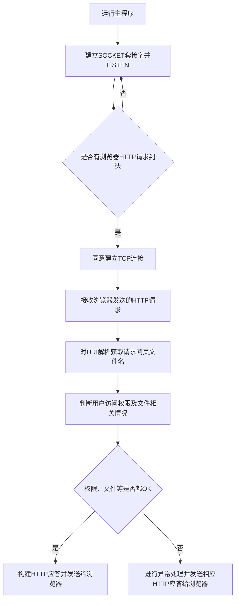

 

```mermaid
flowchart TD
    A[运行主程序]
    A --> B[建立SOCKET套接字并LISTEN]
    B --> C{是否有浏览器HTTP请求到达}
    C -- 是 --> D[同意建立TCP连接]
    D --> E[接收浏览器发送的HTTP请求]
    E --> F[对URI解析获取请求网页文件名]
    F --> G[判断用户访问权限及文件相关情况]
    G --> H{权限、文件等是否都OK}
    H -- 是 --> I[构建HTTP应答并发送给浏览器]
    H -- 否 --> J[进行异常处理并发送相应HTTP应答给浏览器]
    C -- 否 --> B
```